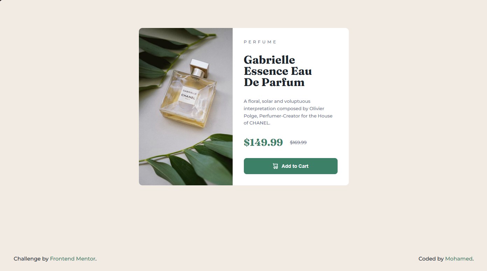
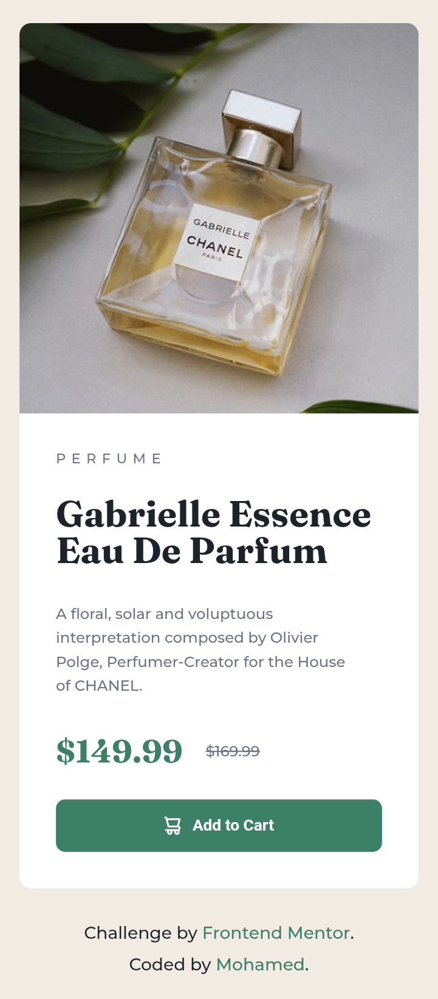

# Frontend Mentor - Product preview card component solution

This is a solution to the [Product preview card component challenge on Frontend Mentor](https://www.frontendmentor.io/challenges/product-preview-card-component-GoAtUmAWJ). Frontend Mentor challenges help you improve your coding skills by building realistic projects.

## Table of contents

- [Overview](#overview)
  - [The challenge](#the-challenge)
  - [Screenshots](#screenshots)
- [My process](#my-process)
  - [Built with](#built-with)
  - [What I learned](#what-I-learned)
- [Author](#author)

## Overview

### The challenge

Users should be able to:

- View the optimal layout depending on their device's screen size
- See hover and focus states for interactive elements

### Screenshots

| Desktop Version | Mobile Version |
| :---: | :---: |
|  |  |

## My process

### Built with

- Semantic HTML5 markup
- CSS custom properties (Variables)
- Flexbox
- Responsive Images (`<picture>` element and media queries)
- Desktop-first and mobile-responsive workflow

### What I learned

Through this project, I strengthened my understanding of CSS Flexbox, handling responsive images efficiently using the `<picture>` element for different screen sizes, and mastering media queries to ensure a seamless layout across both desktop and mobile devices.

## Author

- Frontend Mentor - [@mo-ha-med-9](https://www.frontendmentor.io/profile/mo-ha-med-9)